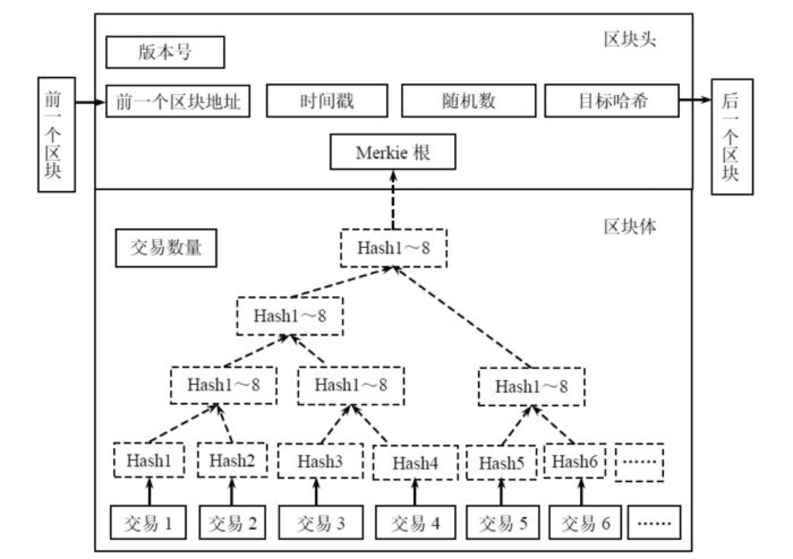
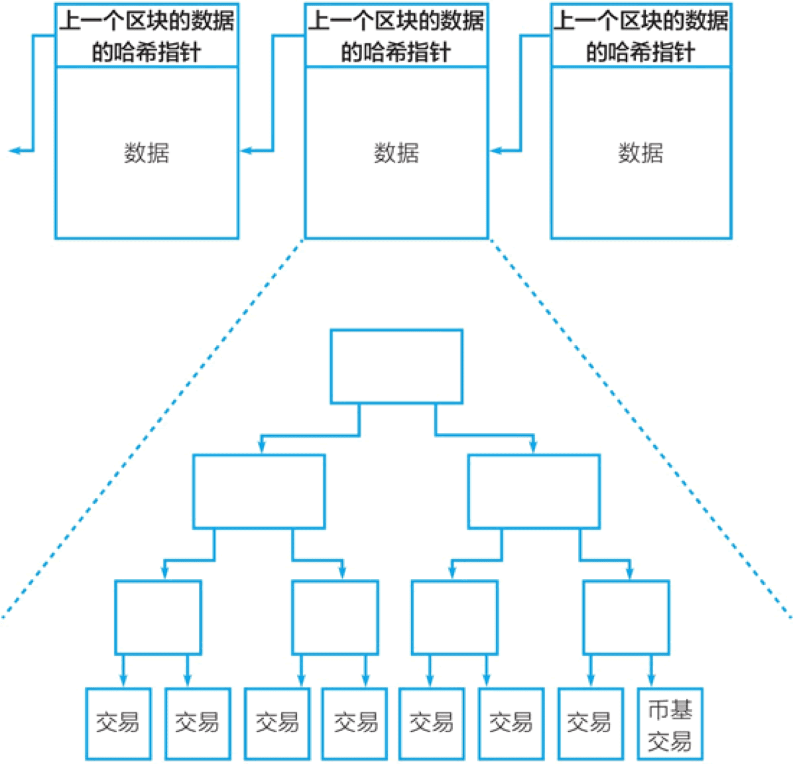

# Blockchain: 还不了解区块链，你就要被时代抛弃了

> **summary**: 别人都在谈论的 Blockchain 到底是个什么高端玩意？它会彻底改变我们的生活吗?
>
> **tags**: 区块链、Blockchain、BTC、Bitcoin、智能合约
>
> **author**: 大熊

---

## 引子

说起 `区块链`， 不得不先介绍一个人。

2008 年 11 月 1 日，一位自称 **中本聪** 的人发表了 **《比特币:一种点对点的电子现金系统》**，也就是 **BTC 白皮书**。阐述了基于 `P2P 网络技术`、`加密技术`、`时间戳技术`、`区块链技术` 等的电子现金系统的构架理念，这标志着 **比特币** 的诞生。两个月后理论步入实践，2009 年 1 月 3 日第一个序号为 0 的 **创世区块** 诞生。几天后 2009 年 1 月 9 日出现序号为 1 的区块，并与序号为 0 的创世区块相连接形成了链，标志着 `区块链` 的诞生。

在 BTC 社区初步建立完成以后，中本聪就隐匿了，到现在都没人知道中本聪到底是谁。

一句话概括一下：**不要迷恋哥，哥只是个传说~**

## 区块链名字由来

其实在 **比特币白皮书** 中，是没有出现过 **区块链（Blockchain）** 这个词的……

白皮书中一段原话：

**the block cannot be changed without redoing the work. As later blocks are chained after it, the work to change the block would include redoing all the blocks after it.**

翻译：

如果不重新生成，区块是不能别改变的，因为后面的区块连接着前面的区块，就像一条链子一样。如果要改变，需要把前面的所有区块都重新生成。

区块链（Blockchain）名字由来：

其实在早期的密码学圈子里，对于比特币的底层技术就是称为 **比特币**，英文则用大写的 B 开头的 **Bitcoin** 指比特币这个网络系统或者网络协议。但是由于大众的混淆，现在一谈起比特币人们就十分抵触，认为比特币就是违法、骗局、传销的代名词，是互联网金融又一个现象级泡沫！于是乎，人们只好将所有的底层技术（时间戳、工作量证明机制等等等）合并起来，为了跟比特币区分，重新取了个名字叫 **Blockchain**，翻译过来就成了 **区块链**，这才有了区块链一词的出现。

🔗 [BTC 代码仓库](https://github.com/bitcoin/bitcoin)

🔗 [BTC 白皮书](https://bitcoin.org/files/bitcoin-paper/bitcoin_zh_cn.pdf)

## 区块链的本质

区块链本质就是一个分布式的 **共享账本** 和 **数据库**。它应用了 **数学**、**密码学**、**互联网**、**计算机编程** 等很多技术，具有 **去中心化**、**匿名性**、**不可篡改**、**全程留痕**、**可追溯**、**集体维护**、**公开透明** 等特点。这些特点保证了区块链的 **诚实** 与 **透明**，为区块链创造信任奠定了基础。

## 区块的结构

区块包含两部分：

- 区块头（Head）：记录当前区块的元信息

- 区块体（Body）：实际数据

### 区块头

区块头包含 6 个部分：

- 版本号
- 前一个块的hash值
- Merkle树的根hash值
- 时间戳
- 难度目标
- nonce (随机数)

**1. 版本号**

在大多数情况下，软件版本号并不重要。但是，具有特定版本号的挖掘程序可以指示它支持哪个协议。

**2. 前一个块的 hash 值**

前一个块的哈希值，也可以说是块的链。因为前一个块的哈希值包含在新块的哈希值中，所以区块链的块都是在彼此的基础上构建的。如果没有这个组件，每个块之间就不会有连接。

**3. Merkle 树的根 hash 值**

块中包含的所有事务都可以聚合到哈希值中。这就是 Merkle 树的根哈希。

**4. 时间戳**

自 1970-01-01 T00: 00 UTC 以来的秒数。

**5. 难度目标**

指示新哈希值必须小到什么程度才能声明有效性。换句话说，每个哈希值都有一个位大小。位的目标越低，就越难找到匹配的哈希值。

**6. nonce（随机数）**

由工作量证明增加的变量。通过这种方式，挖掘器猜测一个有效的哈希值，一个比目标值小的哈希值。

**这六个组件构成了区块头。**

区块头在比特币中扮演着重要角色，因为它将所有区块连接在一起。你可以把它想象成卡车的驾驶舱。这些是卡车通过网络控制时所带的重要文件。

### 区块体

区块体可以想象成卡车的装载空间。它包含与块确认的所有事务。

当挖掘程序构造一个块时，它会验证事务。也就是说，他主要检查寄件人是否有足够的钱。他可以很容易地从区块链中读取这些信息。如果发件人想发送 10 个比特币，他会查看过去的数据块，看看发送者是否已经收到 10 个比特币。

块中的事务不仅在列表中，而且在所谓的 **Merkle 树** 中。

## 什么是 Merkle 树

Merkle 树许多信息可以用一个哈希值表示。为此，首先会对数据本身进行分发哈希值。然后哈希值再次被分发并合并。最后，Merkle 树被合并到一个哈希值中。最后一个哈希值也称为 **根哈希值**，即树的根。它在一个相对较短的字符串中表示其 **叶**（单个事务）和 **分支**（叶的哈希值）的所有信息。

只要知道所有的分支和叶节点，创建根哈希就非常简单快捷。就像哈希值函数一样，它在一个方向上工作得清晰而迅速，在另一个方向上是不可能分解的。如果根哈希值已知，但事务未知，则不可能猜测事务。

因此，仅使用根哈希值是不够的，必须保存块的其余部分。通过再次哈希值块中包含的信息，挖掘器可以在任何时候验证根哈希值。只要哈希值函数相同，对于给定的数据输入，矿工们总是会得到相同的哈希。这非常方便，因为它们只能检查它们是否与哈希值处于同一级别即可。

比特币区块链的数据结构中包括两种哈希指针，它们均是不可篡改特性的数据结构基础。一个是形成 **区块+链**（block + chain）的链状数据结构，另一个是哈希指针形成的 **梅克尔树**。

链状数据结构使得对某一区块内的数据的修改很容易被发现，梅克尔树的结构起类似作用，使得对其中的任何交易数据的修改很容易被发现。

## UTXO

全称：unspent transaction outputs

**未使用的交易输出**，比特币核心概念之一。

在比特币系统上其实并不存在 **账户**，而只有 **地址**。只要你愿意，你就可以在比特币区块链上开设无限多个钱包地址，你拥有的比特币数量是你所有的钱包地址中比特币的总和。比特币系统并不会帮你把这些地址汇总起来形成你的账户。

从我（甲）到你（乙）的一笔比特币转账，是从我的一个钱包地址转到你的一个钱包地址上去。

接下来就涉及比特币系统的一个关键技术性细节：**UTXO（未使用的交易输出）**。通证经济专家 **孟岩** 曾撰写一篇文章，标题是 **其实没有什么比特币，只有 UTXO**，这个标题指出了，对于计算机来说比特币是什么——比特币是区块链账本上的交易输出。

我们来看一个两个人进行转账交易的过程，以深入理解 UTXO：

假设我有 8 个比特币，这其实意味着，之前有一个交易把这些比特币转入我的地址，这个交易的输出（即 8 个比特币）未被使用，我拥有了这 8 个比特币。

现在，我要发起一个转账交易，这个交易中的输入是让我拥有这些比特币的上一个交易。

我要转账给你，我做的是，对让我拥有这些 8 个比特币的上一个交易进行签名，把这一新转账交易的输出地址设为你的钱包地址。

这样，我就发起了一个转账支付交易。等矿工将这一交易打包进新的区块，转账交易完成，这 8 个比特币就属于你了。你拥有的是你我这个交易的 **未使用的交易输出（UTXO）**。

为便于理解可类比看，钱包地址相当于 **房间号和锁**，私钥则相当于 **钥匙**，钥匙可以打开对应的锁。

那以上两个人的转账交易过程，可以看作：我用私钥（从一个输出是我的地址的交易中）取出比特币，并用私钥对从我的地址转到你的地址的新交易进行签名。一旦交易完成，这些比特币就转到你的钱包地址中去。你的钱包中新交易的未使用交易输出，只有你的私钥才可以打开。

综上所述，的确不存在比特币，只有 **未使用的交易输出（UTXO）**。每一笔比特币都源自上一个交易，可以一直向上追溯上去。而一直向上追溯，在每一笔比特币的源头，都有一种特殊的交易，即比特币矿工因挖矿获得奖励的 **创币交易**，每一个比特币都是通过挖矿被创造出来的。假设我作为比特币矿工挖矿成功赢得了 25 个比特币，那么这个特殊交易，它的输入是 0，而输出是 25 个比特币进到矿工的钱包地址中。

**未使用的交易输出（UTXO）** 和我们熟悉的银行账户有着很大的不同。为什么要采用这样的设计？对比银行账户和比特币的 UTXO，我们可以看到 UTXO 的优点。

### 为什么采用 UTXO 的形式

你的比特币就是 **UTXO**。

比特币的挖矿节点获得新区块的挖矿奖励，比如 12.5 个比特币，这时，它的钱包地址得到的就是一个 **UTXO**，即这个新区块的**币基交易**（也称 **创币交易**）的输出。币基交易是一个特殊的交易，它没有输入，只有输出。

当甲要把一笔比特币转给乙时，这个过程是把甲的钱包地址中之前的一个 **UTXO**，用私钥进行签名，发送到乙的地址。这个过程是一个新的交易，而乙得到的是一个新的 **UTXO**。

这就是为什么有人说在这个世界上根本没有比特币，只有 **UTXO**，你的地址中的比特币是指没花掉的交易输出。

**UTXO** 与我们熟悉的账户概念的差别很大。我们日常接触最多的是账户，比如，我在银行开设一个账户，账户里的余额就是我的钱。

但在比特币网络中没有账户的概念，你可以有多个钱包地址，每个钱包地址中都有着多个 **UTXO**，你的钱是所有这些地址中的 **UTXO** 加起来的总和。

中本聪发明比特币的目标是创建一个点对点的电子现金，**UTXO** 的设计正可以看成是借鉴了现金的思路：我们可能在这个口袋里装点现金，在那个柜子角落里放点现金，在这种情况下不存在一个账户，你放在各处的现金加起来就是你所有的钱。

采用 **UTXO** 设计还有一个技术上的理由，这种特别的数据结构可以让 **双重花费** 更容易验证。对比一下：如果采用账户和账户余额设计，A 要转账给 B，为了确保 A 的确有钱，我们需要核查她之前所有的交易。随着时间的推移，比特币的交易越来越多，这个验证的难度会持续上升。

采用 **UTXO** 设计，我们只要沿着每个交易的输入逐级向上核查，直到查到这笔比特币的 **创币交易** 即可。随着时间的推移，这个核查也会变难，但变难的速度要远低于采用账户和账户余额设计。

这种设计使得比特币系统作为一种电子现金系统有着非常大的可扩展性。

## 共识机制

区块链是去中心化的，没有中心记账节点，所以需要对账本达成共识。共识机制是区块链的核心技术，当区块链技术越来越多应用于现实，共识机制也在不断的改进，目前的共识机制主要有三种：**PoW**、**PoS**、**DPoS**

**共识机制的背景**

加密货币都是去中心化的，去中心化的基础就是 P2P 节点众多，那么如何吸引用户加入网络成为节点，有哪些激励机制？同时，开发的重点是让多个节点维护一个数据库，那么如何决定哪个节点写入？何时写入？一旦写入，又怎么保证不被其他的节点更改（不可逆）？回答这些问题的答案，就是 **共识机制**。

比特币使用的是 **PoW** 共识机制，比特币已经运行了 13 年，这种机制也得到了证明。 

然而 **PoW** 会涉及到众所周知的挖矿，会消耗巨大的电力，这也就是 **PoW** 机制最受诟病的地方。随后就有人提出 **PoS** 和 **DPoS** 的机制。

### PoW

工作量证明机制（Proof of Work）。

PoW 是第一代共识机制，也是比特币的基础。

理解起来很简单，就是 **按劳取酬**，你付出多少工作量，就会获得多少报酬（比特币等加密货币）。

在网络世界里，这里的劳动就是你为网络提供的计算服务（算力 x 时长），提供这种服务的过程就是 **挖矿**。人们 **挖矿** 所得的比重与各自提供的算力成正比，通俗一点就是，能力越强获得越多。

**优点：**

1. 机制本身当然很复杂，有很多细节，比如：挖矿难度自动调整、区块奖励逐步减半等。
（BTC 每产生 210000 个区块，奖励减半一次，起初打包一个区块奖励 50 个 BTC，现在已经经历了 3 次减半， 所以现在每打包一个区块, 奖励 6.25 个 BTC），这些因素都是基于经济学原理，能吸引和鼓励更多人参与。

2. 理想状态，这种机制可以吸引很多用户参与其中，特别是越先参与的获得越多，会促使加密货币的初始阶段发展迅速，节点网络迅速扩大。在 CPU 挖矿的时代，比特币吸引了很多人参与 **挖矿**，就是很好的证明。

3. 通过 **挖矿** 的方式发行新币，把比特币分散给个人，实现了相对公平。

**缺点：**

1. 算力是计算机硬件（CPU、GPU 等）提供的，要耗费电力，是对能源的直接消耗，与人类追求节能、清洁、环保的理念相悖。不过，如果非要给加密货币找寻 **货币价值** 的意义，那么这个方面，应该是最有力的证据。

2. 这种机制发展到今天，算力的提供已经不再是单纯的 CPU 了，而是逐步发展到 GPU、FPGA，乃至 ASIC 矿机。用户也从个人挖矿发展到大的矿池、矿场，算力集中越来越明显。这与去中心化的方向背道而驰，渐行渐远，网络的安全逐渐受到威胁。有证据证明 Ghash（一个矿池）就曾经对赌博网站实施了 **双花攻击**。

3. 比特币区块奖励每 ４ 年将减半，当挖矿的成本高于挖矿收益时，人们挖矿的积极性降低，会有大量算力减少，比特币网络的安全性进一步堪忧。

### PoS

股权证明机制（Proof of Stake）。

PoS 是 **点点币（PPC）** 的创新。(这个币还是头一次听说)。

没有挖矿过程，在创世区块内写明了股权分配比例，之后通过转让、交易的方式（通常就是 **IPO**），逐渐分散到用户手里，并通过 **利息** 的方式新增货币，实现对节点的奖励。

简单来说，就是一个根据用户持有货币的多少和时间（币龄），发放利息的一个制度。

现实中最典型的例子就是股票，或者是银行存款。如果用户想获得更多的货币，那么就打开客户端，让它保持在线，就能通过获得 **利息** 获益，同时保证网络的安全。

**优点：**

1. 节能。不用挖矿，不需要大量耗费电力和能源。

2. 更去中心化。首先，去中心化是相对的。相对于比特币等 PoW 类型的加密货币，PoS 机制的加密货币对计算机硬件基本上没有过高要求，人人可挖矿（获得利息），不用担心算力集中导致中心化的出现，网络更加安全有保障。

3. 避免紧缩。PoW 机制的加密货币，因为用户丢失等各种原因，可能导致通货紧缩，但是 PoS 机制的加密货币按一定的年利率新增货币，可以有效避免紧缩出现，保持基本稳定。比特币之后，很多新币采用 PoS 机制，很多采用工作量证明机制的老币，也纷纷修改协议，**硬分叉** 升级为 PoS 机制。

**缺点：**

1. 纯 PoS 机制的加密货币，只能通过 IPO 的方式发行，这就导致少数人（通常是开发者）获得大量成本极低的加密货币，在利益面前，很难保证他们不会大量抛售。

2. PoS 机制的加密货币，信用基础不够牢固。

3. 为解决这个问题，很多采用 PoW + PoS 的双重机制，通过 PoW 挖矿发行加密货币，使用 PoS 维护网络稳定。或者采用 DPoS 机制，通过社区选举的方式，增强信任。

### DPoS

授权股权证明机制（Delegated Proof of Stake）。

类似于人民代表大会制度。

DPoS 是 **比特股（BTS）** 最先引入的。

比特股首次提出了 **去中心化自治公司（DACs）** 的理念。比特股的目的就是用于发布 DACs。这些无人控制的公司发行股份，产生利润，并将利润分配给股东。实现这一切不需要信任任何人，因为每件事都是被硬编码到软件中的。通俗点讲就是：比特股创造可以盈利的公司（股份制），股东持有这些公司的股份，公司为股东产生回报，无需挖矿。

对于 PoS 机制的加密货币，每个节点都可以创建区块，并按照个人的持股比例获得 **利息**。

DPoS 是由被社区选举的可信帐户（受托人，得票数排行前 101 位）来创建区块。

为了成为正式受托人，用户要去社区拉票，获得足够多用户的信任。用户根据自己持有的加密货币数量占总量的百分比来投票。DPoS 机制类似于股份制公司，普通股民进不了董事会，要投票选举代表（受托人）代他们做决策。

这 101 个受托人可以理解为 101 个矿池，而这 101 个矿池彼此的权利是完全相等的。那些握着加密货币的用户可以随时通过投票更换这些代表（矿池），只要他们提供的算力不稳定，计算机宕机、或者试图利用手中的权力作恶，他们将会立刻被愤怒的选民们踢出整个系统，而后备代表可以随时顶上去。

**优点：**

1. 能耗更低。DPoS 机制将节点数量进一步减少到 101 个，在保证网络安全的前提下，整个网络的能耗进一步降低，网络运行成本最低。

2. 更加去中心化。目前，对于比特币而言，个人挖矿已经不现实了，比特币的算力都集中在几个大的矿池手里，每个矿池都是中心化的，就像 DPoS 的一个受托人，因此 DPoS 机制的加密货币更加去中心化。PoS 机制的加密货币，要求用户开着客户端，事实上用户并不会天天开着电脑，因此真正的网络节点是由几个股东保持的，去中心化程度也不能与 DPoS 机制的加密货币相比。

3. 更快的确认速度。每个块的时间为 10 秒，一笔交易（在得到 6-10 个确认后）大概 1 分钟，一个完整的 101 个块的周期大概仅仅需要 16 分钟。而比特币（ PoW 机制）产生一个区块需要 10 分钟，一笔交易完成（6 个区块确认后）需要 1 个小时。点点币（PoS 机制）确认一笔交易大概也需要 1 小时。

**缺点：**

1. 投票的积极性并不高。绝大多数持股人（90％+）从未参与投票。这是因为投票需要时间、精力以及技能，而这恰恰是大多数投资者所缺乏的。

2. 对于坏节点的处理存在诸多困难。社区选举不能及时有效的阻止一些破坏节点的出现，给网络造成安全隐患。

关于 DPoS，现实生活中有更多的类似于 DPoS 的制度。比如中国的人民代表大会制度、美国的两会制度。

就以人民代表大会制度为例。每个省市通过选举选择出自己的代表，然后由这些代表参加人名代表大会，这样会更有效率，也能组织起更多的人。

### 小结

1. PoW 工作量证明机制。类似于按劳分配。

2. PoS 股权证明机制。持有股票的人，就有对应的权利，持有的越多，权利越大。

3. DPoS 授权股权证明机制。类似于董事会。董事会成员数量有限，由大家选举产生。被选中的董事会成员可以行使权利。

从机制设计上来看，PoW 机制更加强调去中心，更加强调对等。 而 DPoS 则是有一个明显的中心，通过带来部分中心，来得到效率的提升。哪一种机制更好，有待时间的验证。 PoW 已经运行快 13 年，电力耗费已经非常严重。 DPoS的出现，有可能让记账这件事情更经济效率，从而支撑起更多大规模的协作体系。

## 51% 攻击

什么是 **51% 攻击**？

简单来说，就是如果某个节点拥有超过全网 51% 的算力，将能够实现 **双重支付**、**撤销交易** 等操作，让比特币网络崩溃。

那么，这个 51% 攻击是什么实现的？

假设一个场景，A 用 10 比特币向 B 购买一样商品，步骤如下：

1. A 支付给 B 10 个 BTC；

2. B 收到 10 个 BTC 确认收款后发货（一般认为 6 次确认后交易就不可逆转）；

3. A 随即创建另一笔交易，将同样的 10 个 BTC 支付给自己。

显然，A 想要撤销第一笔交易，不用花钱就得到 B 的商品。为了达到这个目的，A 进行了双重支付，将同样的 10 个 BTC 支付给 B 和自己。在正常的比特币网络中，一旦第一笔交易经过 6 次确认后就几乎不可更改，后续的交易数据将继续打包成新的区块依次链接下去。可是，如果 A 用户拥有 51% 的算力，情况将会发生有趣的变化，A 可以实现双重支付的目的。

具体过程如下👇🏻：

假设第一笔交易被打包到 100 号区块，当后面再增加 5 个区块后，6 次即可确认该交易。

这时，A 又发起了一次给自己 10 个 BTC 的交易。如果 A 向全网广播，这笔交易不会被处理（因为找不到要花费的 UTXO，10 个 BTC 支付给 B 的事实已经被全网确认了），所以 A 选择不广播，而是对主链进行 **分叉**，生成另外一个 100 号区块，并在其中打包第二笔交易。

由此，产生了两条子链。

第一笔交易所在的叫 C1，第二笔交易所在的叫 C2。其他矿工继续在 C1 上打包数据，而 A 则在 C2 上挖矿，两条链开始赛跑。由于 A 具有超 51% 的算力资源，很快，C2 的长度就会超过 C1；

这时，按照比特币的最长链优先原则，其他矿工也会自动转到 C2 上，使 C2 变成了主链。C1 则会被抛弃，之前打包在 C1 上的所有交易（包括第一笔 A 支付给 B 10 个 BTC 的交易），都会变为无效。结果是 A 不花一分钱就拥有了属于 B 的商品，这就是 **51%攻击**。

**51% 攻击能做到：**

1. 修改自己的交易记录，如双重支付；

2. 阻止确认部分或全部交易。

**51% 攻击没法做到的：**

1. 凭空生成比特币；

2. 修改每个区块产生的比特币数量。

当然，要真正实现 51% 攻击是非常困难的，在比特币网络中几乎是不可能的，因为这需要消耗巨大的成本，跟攻击成功后获取到的收益相比，完全是得不偿失。

因此，51% 攻击成本巨大，收益却很小，仅能实现 **双重支付** 而已。所以 51% 攻击很多时候又被称为 **双花攻击**。**双花** 是数字货币要解决的第一个核心问题，比特币通过共享账本和工作量证明共识机制比较完美地解决了这个问题。

## 区块链 “不可能三角”

一个区块链项目无法同时满足三个条件，最多只能同时满足两个条件：

1. 可扩展性（scalability）

2. 去中心化（decentralization）

3. 安全（security）

## 区块链的应用

区块链在金融领域有着天生的优势，在互联网上来说，这是区块链的基因决定的。主观来看，金融机构在区块链应用的探索上意愿最强，需要新的技术来提高运营效率，降低成本来应对整个全球经济当前现状。客观来看，金融行业市场空间巨大，些许的进步就能带来巨大收益。金融行业是对安全性、稳定性要求极高的行业，如果区块链在金融领域应用得以验证，那么将会产生巨大的示范效应，迅速在其他行业推广。在金融领域，除去数字货币应用，区块链也逐渐在跨境支付、供应链金融、保险、数字票据、资产证券化、银行征信等领域开始了应用。

### 数字货币

目前区块链技术最广泛、最成功的运用是以比特币为代表的数字货币。近年来数字货币发展很快，由于去中心化信用和频繁交易的特点，使得其具有较高交易流通价值，并能够通过开发对冲性质的金融衍生品作为准超主权货币，保持相对稳定的价格。

自从有了比特币之后，已经陆续出现了数百种的数字货币，围绕着数字货币生成、存储、交易形成了较为庞大的产业链生态。以比特币为例，参与机构主要可分为基础设施、交易平台、ICO 融资服务、区块链综合服务等四类。

### 保险业务

随着区块链技术的发展，未来关于个人的健康状况、事故记录等信息可能会上传至区块链中，使保险公司在客户投保时可以更加及时、准确地获得风险信息，从而降低核保成本、提升效率。区块链的共享透明特点降低了信息不对称，还可降低逆向选择风险；而其历史可追踪的特点，则有利于减少道德风险，进而降低保险的管理难度和管理成本。

### 资产证券化

这一领域业务痛点在于底层资产真假无法保证；参与主体多、操作环节多交易透明度低出现信息不对称等问题，造成风险难以把控。数据痛点在于各参与方之间流转效率不高、各方交易系统间资金清算和对账往往需要大量人力物力、资产回款方式有线上线下多种渠道，无法监控资产的真实情况，还存在资产包形成后，交易链条里各方机构对底层资产数据真实性和准确性的信任问题。

区块链去中介化、共识机制、不可篡改的特点，增加数据流转效率，减少成本，实时监控资产的真实情况，保证交易链条各方机构对底层资产的信任问题。

### 数字票据

该领域痛点在于三个风险问题。操作风险，由于系统中心化，一旦中心服务器出问题，整个市场瘫痪；市场风险，根据数据统计，在2016 年，涉及金额达到数亿以上的风险事件就有七件，涉及多家银行；道德风险，市场上存在 **一票多卖**、虚假商业汇票等事件。区块链去中介化、系统稳定性、共识机制、不可篡改的特点，减少传统中心化系统中的操作风险、市场风险和道德风险。

### 跨境支付

该领域的痛点在于到账周期长、费用高、交易透明度低。以第三方支付公司为中心，完成支付流程中的记账、结算和清算，到账周期长，比如跨境支付到账周期在三天以上，费用较高。区块链去中介化、交易公开透明和不可篡改的特点，没有第三方支付机构加入，缩短了支付周期、降低费用、增加了交易透明度。

### 征信管理

该领域的痛点在于数据缺乏共享，征信机构与用户信息不对称；正规市场化数据采集渠道有限，数据源争夺战耗费大量成本；数据隐私保护问题突出，传统技术架构难以满足新要求等。在征信领域，区块链具有去中心化、去信任、时间戳、非对称加密和智能合约等特征，在技术层面保证了可以在有效保护数据隐私的基础上实现有限度、可管控的信用数据共享和验证。

### 供应链金融

这一领域的痛点在于融资周期长、费用高。以供应链核心企业系统为中心，第三方增信机构很难鉴定供应链上各种相关凭证的真伪，造成人工审核的时间长、融资费用高。区块链去中介化、共识机制、不可篡改的特点，不需要第三方增信机构鉴定供应链上各种相关凭证的真实性，降低融资成本、减少融资的周期。

## 总结

总之，新技术的到来总是如洪水猛兽一般，会把好多旧有的企业拍死在沙滩上。我们的生活也会随之发生翻天复地的改变。

区块链的发展目前还是处于早期阶段，现在或许正是布局入场的大好时机，挽起裤腿跑步🏃🏻入场吧，或许下一个 **埃隆马斯克** 就是你。

