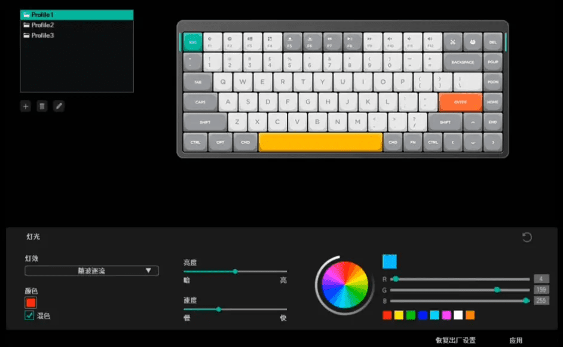
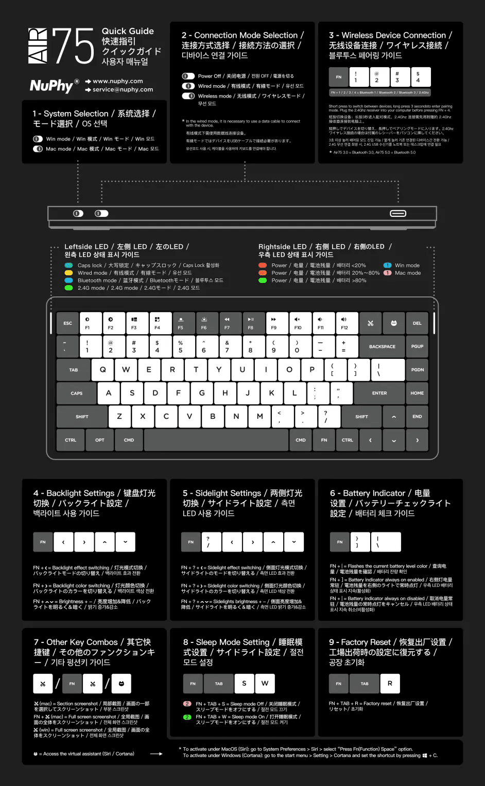

# Nuphy Air75使用手册+固件升级

> **summary**: Nuphy Air75使用手册+固件升级
>
> **tags**: 键盘、程序员
>
> **author**: 大熊

---

## F 功能键设置修改

Nuphy Air75 的 F 功能键默认是多媒体功能（比如 F11，F12 是音量调节），需要配合 FN 键才能实现原本的 F 功能键（比如 FN + F12 等于普通键盘的 F12），对于程序猿之类常用 F 功能键的用户来说比较麻烦。

此时可以跟客服索要最新固件，他会给你发来最新固件。

然后按照固件使用说明升级固件：

1. 将键盘切换至有线模式；
2. 用线材链接Win系统；
3. 测试键盘是否正常；
4. 安装固件；
5. 拔掉线缆；
6. 关闭键盘；
7. 重新打开键盘；
8. 链接设备测试；
9. 完成固件升级。

升级成功之后，使用 FN + TAB + F，右侧灯会闪动，证明设置成功，此时按 F12 即为 F12，无需再配合 FN 键了。

另外注意，从有线模式切换回无线模式，有时候不会自动连接到电脑，需要手动按 Fn+1~4 这几个数字键切换到之前的蓝牙或 2.4G 模式才能连接成功。 

也可以去官网下载，但需翻墙：

https://nuphy.com/pages/firmwares-for-air75 

## Nuphy 控制台

可以用来设置键盘灯，自定义功能按键等等，功能十分强大。

官网下载地址（需翻墙）：

https://nuphy.com/pages/nuphy-console

或者直接找客服索要。

## Nuphy 使用手册电子版

Tips: 如果感觉电量没的太快，可以按 FN + TAB + W 打开睡眠模式，这样不使用时就会休眠，别键盘默认开启，Nuphy 需要手动打开。

## 文字总结

键盘顶部为 系统切换、模式切换 开关

Fn + 数字键 1234 ：切换无线链接模式，分别对应蓝牙 123 + 2.4G

Fn + ? + < ：侧面灯光模式切换  

Fn + ? + > ：侧面灯光颜色切换   

Fn + ? + 上下键 ：侧面灯光亮度

左侧 LED 灯，白色是大写锁定，黄色有线模式，蓝色蓝牙，绿色 2.4G

Fn + | ：查询电量，在右侧 LED 显示     

Fn + ] ：右侧电量常驻   

Fn + | ：取消电量常驻

右侧 LED 灯，蓝色 windows，粉色 Mac，红黄绿 表示电量

Fn + 左键 ：键盘灯光模式切换  

Fn + 右键 ：键盘灯光颜色切换   

Fn + 上下键 ：键盘灯光亮度

Mac 模式下 ：剪刀键 局部截图， Fn + 剪刀键，全屏截图     

Windows 下 ：剪刀键 全屏截图

Fn + TAB + W ：打开睡眠模式

Fn + TAB + S ：关闭睡眠模式     

Fn + TAB + R ：恢复出厂配置 

