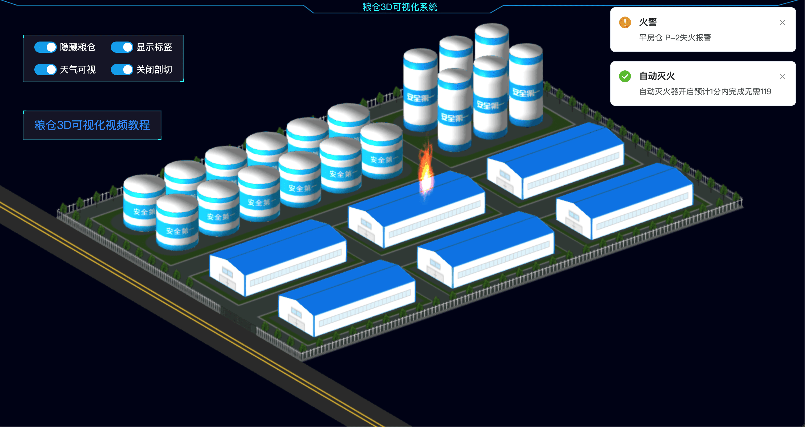
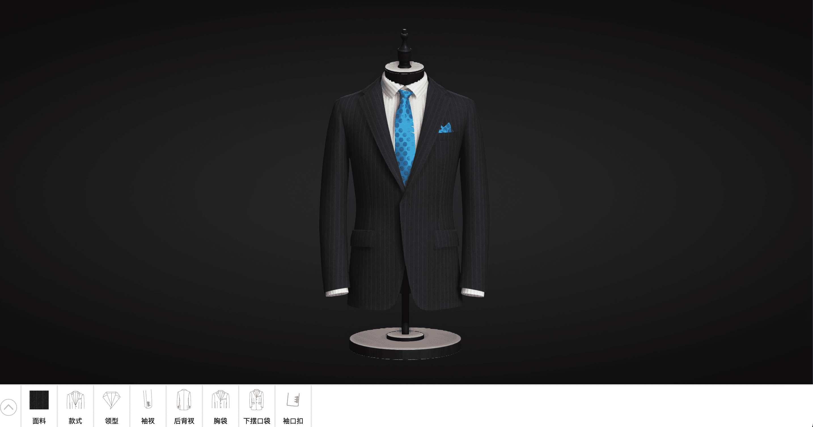
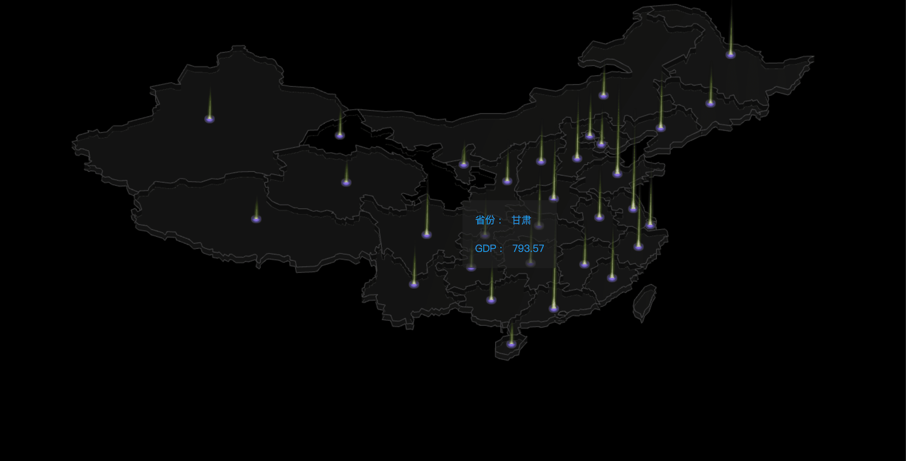
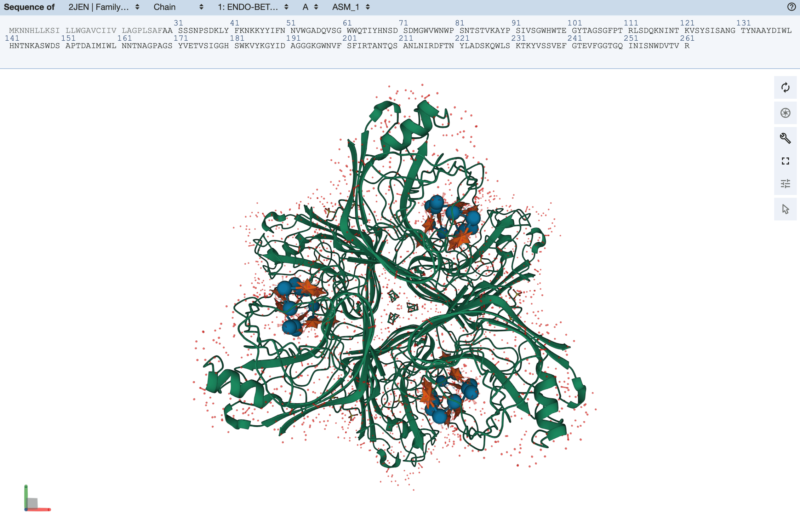
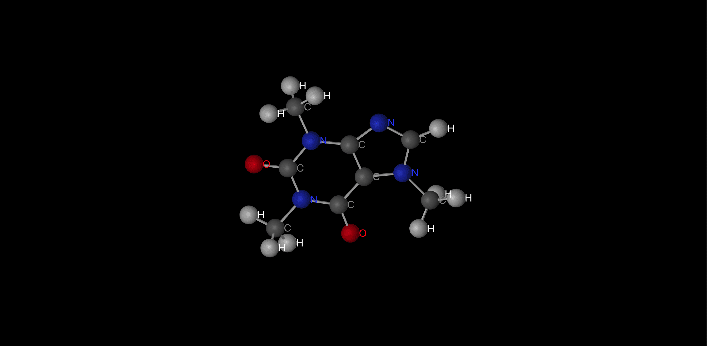
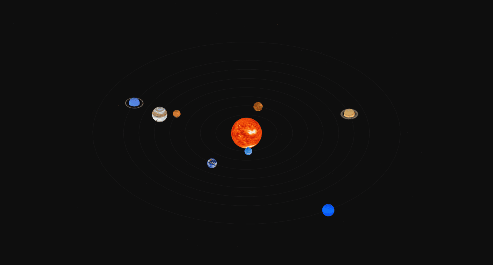
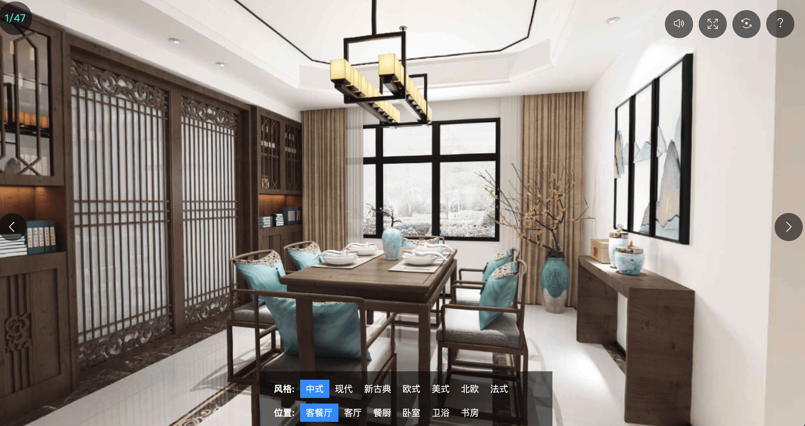
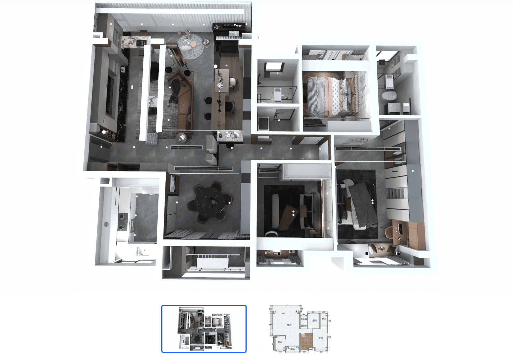

# ThreeJS 初探

> **summary**: 看到网页上那些炫酷的 3D 游戏及画面难道你不心动吗
>
> **tags**: ThreeJS、WedGL、3D
>
> **author**: 大熊

---

## ThreeJS 是个啥

ThreeJS 是基于原⽣ WebGL 封装运⾏的三维引擎，在所有 WebGL 引擎中，ThreeJS 是国内资料最多、使⽤最⼴泛的三维引擎。

## WebGL 是个啥

WebGL（Web 图形库）是一个 `JavaScript API`，可在任何兼容的 Web 浏览器中渲染高性能的交互式 3D 和 2D 图形，而无需使用插件。WebGL 通过引入一个与 `OpenGL ES 2.0` 非常一致的 API 来做到这一点，该 API 可以在 HTML5 `<canvas>` 元素中使用。 这种一致性使 API 可以利用用户设备提供的硬件图形加速。

目前支持 WebGL 的浏览器有：Firefox 4+、 Google Chrome 9+、 Opera 12+、 Safari 5.1+、 Internet Explorer 11+ 和 Microsoft Edge build 10240+。然而，WebGL 一些特性也需要用户的硬件设备支持。

WebGL 2 API 引入了对大部分的 OpenGL ES 3.0 功能集的支持，它是通过 `WebGL2RenderingContext` 界面提供的。

`<canvas>` 元素也被 `Canvas API` 用于在网页上进行 2D 图形处理。

## ThreeJS 应用领域

### 1.物联⽹3D可视化

⽐如你通过⽹⻚⻚⾯远程控制⼯⼚中的⼀台机器启动或关停，你可以在⽹⻚上通过 `div` 元素写⼀个按钮，然后表示机器设备的开关。

当然你也可以把该设备以 3D 的形式展示在⽹⻚上，然后就像玩游戏⼀样直接点击模型上的开关按钮，这两种⽅式肯定是 3D ⽅式更为直观，当然开发成本也⽐较⼤。

🔗 [物联⽹3D可视化案例](http://www.yanhuangxueyuan.com/3D/liangcang/index.html)

### 2.产品在线预览

现在你朋友推荐给你⼀款新⾐服，你会说发⼀张图⽚看看，也许将来你会说发来⼀个 3D 模型链接看看。

🔗 [服装在线预览](http://suit.xuantech.cn/)

### 3.数据可视化

与 WebGL 相关的数据可视化主要是两⽅⾯，⼀⽅⾯是海量超⼤数据的可视化，另⼀⽅⾯是与 3D 相关的数据可视化。对于超⼤的海量数据⽽⾔，基于 `canvas`、`svg` 等⽅式进⾏ Web 可视化，没有基于 WebGL 技术实现性能更好，对于 3D 相关的数据可视化基于 WebGL 技术，借助 3D 引擎 ThreeJS 可以很好的实现。

🔗 [解析 GeoJOSN 数据中国 GDP 数据可视化](http://www.yanhuangxueyuan.com/3D/geojsonChina/index.html)

### 4.H5/微信⼩游戏

⾮常⽕的 微信⼩游戏 **跳⼀跳** 就是使⽤ ThreeJS 引擎开发的。 开发 3D 类的 H5 ⼩游戏或者微信⼩游戏，ThreeJS 引擎是⾮常好的选择。

通过 ThreeJS 开发的⼩游戏，可以直接部署在微信⼩程序或者 Web 端，⽆需下载，⽅便传播，⽬前的⽣态⾮常适合⼩游戏开发。

### 5.科技领域

🔗 [科研平台-蛋⽩质结构可视化案例](http://www.rcsb.org/3d-view/2JEN/1)

🔗 [化学相关-分⽀结构可视化](http://www.yanhuangxueyuan.com/3D/fenzi/index.html)

🔗 [地理天⽂-太阳系3D预览](http://www.yanhuangxueyuan.com/3D/solarSystem/index.html)

### 6.WebVR

对于现在⽐较⽕的 `VR`、`AR` 概念，WebGL 技术的出现，也是⼀个好消息，如果你想预览⼀些 VR 内容，完全可以不下载⼀个 VR 相关的 APP，通过 ThreeJS 引擎实现 VR 内容发布，然后⽤户直接通过微信等社交⽅式推⼴，直接打开 VR 内容链接就可以观看。

VR 与 Web3D 技术结合⾃然就衍⽣出来⼀个新的概念 `WebVR`，也就是基于 Web 实现的 VR 内容。

🔗 [室内设计作品展示](http://www.yanhuangxueyuan.com/3D/houseDesign/index.html)

🔗 [云装修平台](https://www.kujiale.com/)

## 三维模型在线预览平台

🔗 [sketchfab](https://sketchfab.com/)

> https://sketchfab.com/

🔗 [动动三维](https://www.ddd.online/)

> https://www.ddd.online/

🔗 [琢刻](https://gizmohub.com/)

> https://gizmohub.com/

## ThreeJS 相关⽂档链接

🔗 [ThreeJS 中⽂教程](http://www.webgl3d.cn/Three.js/)

> http://www.webgl3d.cn/Three.js/

🔗 [WebGL 教程](http://www.webgl3d.cn/WebGL/)

> http://www.webgl3d.cn/WebGL/

🔗 [代码案例](http://www.webgl3d.cn/threejs/examples/)

> http://www.webgl3d.cn/threejs/examples/

🔗 [官⽹](https://threejs.org/)

> https://threejs.org/

