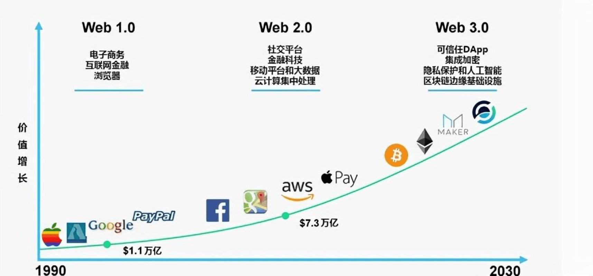
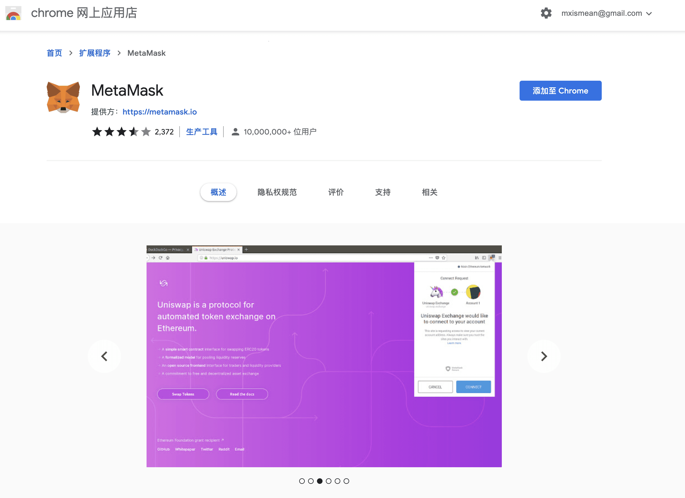

# Web3.0 已来

> **summary**: Web3.0 已来，Web2.0 会被拍死在沙滩上吗？
>
> **tags**: 元宇宙、Web3.0、Web2.0
>
> **author**: 大熊

---

## 前言

在当前元宇宙的风口下，Web3.0 也更是成为了热议话题，也是 21 年美国众议院加密金融听证会出现的高频词汇。据谷歌趋势数据显示，过去一年中，**Web3.0** 一词的全球搜索量大幅上升。其中，21 年 11 月及 12 月期间，上升幅度尤为明显。

Web3.0 是一个相对笼统的术语，目前仍然是一个代表着未来的愿景和想法，大家对于 Web3.0 的具体定义见仁见智，因此围绕这一话题也出现了很多不同观点的探讨甚至是争议。

## Web3.0到底是什么🤔

Web3.0 是一个相对于 Web1.0 和 Web2.0 的概念，认识 Web3.0 之前我们要先了解一下 Web1.0 和 Web2.0。

### Web1.0

Web1.0 指的是第一代互联网，以早期的门户、搜索网站为代表，它的主要特点是网络平台单向地向用户提供内容。这个阶段的用户只能被动地接收网络传递的内容，无法参与到网络中。

### Web2.0

Web2.0 指的是第二代互联网，开始转向交互，用户不再是内容的被动接收者，而是可以在网络平台创建自己的内容（包括文字、图片、视频等等），并和网络上其它用户进行交互。在这一阶段，互联网从单向传播变成了双向互动。也就是我们正处于的自媒体社交时代。

### Web3.0

Web3.0 被称为下一代互联网，之所以提出这一想法，是因为 Web2.0 暴露出了一些问题，最大的问题就是互联网大多数控制权集中在各个中心化公司手中，用户信息数据几乎无隐私可言。而 Web3.0 则是要解决 Web2.0 的问题，用 Blockchain 等去中心化技术，把用户在交互过程中创造出来的价值返回给用户和参与者，这是 Web3.0 在经济上的意义。因此，Web3.0 相对 Web2.0 来说是一种更加深层次的变革，它的关键不在于性能和交互的转变，而是在于控制，把控制权返还到用户手中。

最早正式提出 Web3.0 概念的是 Polkadot、Web3.0 基金会创始人 Gavin Wood，2014 年，Gavin 还在担任以太坊 CTO 时创造了 Web3.0 这个词，并描述了心中的 Web3.0 时代。他强调的 Web3.0 旨在平均分配在线权力，从大型科技平台上夺走控制权，它将存在于 Blockchain 上分散给每一个人。

### Web1.0 -> Web2.0 -> Web3.0 演进过程

因此，真正的 Web3.0 是由人控制的互联网，**去中心化** 是 Web3.0 的核心理念，而隐私、数据、权利、审查、身份等等这些都是 Web3.0 关心的话题。这些与当下 Blockchain 技术的本质极为契合， Blockchain 技术的去中心化存储、无法篡改、信息加密等特点可以颠覆如今互联网巨头垄断局面，改变数据服务商滥用权限的问题，把互联网权利还给网络参与者个人。从这一概念上来说，有不少加密社区的人宽泛地理解认为目前大多数 Blockchain 项目都属于 Web3.0 范畴。

## Web3.0 发展现状

尽管 Web3.0 仍然是一个雏形，但这一概念的提出给 Blockchain 行业尤其是应用层面也带来了非常大的跃迁。在 Web3.0 的愿景下，催生出了许多承载着这一概念的解决方案和协议。Web2.0 正在被初具规模的 Web3.0 取代，这是时代大势。

## 5 个方面看 Web3.0 基础设施现状

- 支付工具：MetaMask
- 域名系统：ENS、TNS
- 存储工作：Filecoin、Arweave
- 内容分发平台：Mirror
- 去中心化社交工具：Telegram、Discord

可以认为 Web3.0 已经初具形态。

### 以 MetaMask 为代表的支付工具

在去中心化支付领域，应用可分为广义与狭义，狭义应用包括最知名的 MetaMask、Polkadot、Ronin Wallet、imToken 等专注于支付的工具，广义应用是一切支持链上支付功能的基础设施，包括各类比特币以太坊加密钱包，Layer 2 平台与 Layer 1 公链之间的**桥**，甚至包括中心化平台之间的转账窗口。

这其中最具革命性的当属 MetaMask 这样的应用。MetaMask 被誉为世界上最优秀最好用的以太坊开源钱包，能够帮助投资者轻松简便地管理自己的以太坊资产。使用 MetaMask 无需下载客户端，只需要添加至浏览器扩展程序即可使用。

### 域名系统

众所周知，域名是互联网上的私有主页，是个人与企业完全控制的**在线房地产**，域名可以是虚构的，也可以是透明的描述，可用于从个人博客到跨国公司的公共网站的所有内容。域名可以很小，是个人作品的汇总集合，也可以是每天访问量数以百万计的购物网站与社交媒体。

不过，在 Web2.0 时代，一切都运行在中心化网络之上，即便对某域名存在所有权，该域名依然被保存在中心化服务器上，易受人为控制。

ENS 与 TNS 这类去中心化域名系统的出现，将改变这一现状。

ENS，是 Ethereum Name Service 的缩写，中文名字叫**以太坊域名服务**，是一个基于以太坊 Blockchain 的可扩展，分布式和开放式命名系统，主要服务于人类可读的映射名称。ENS 将人类可读的名称，比如 **bb.eth** 映射到机器可读的标识符，具有读取以太坊地址，内容哈希和元数据的功能。TNS 是 Terra Name Service 的缩写，是一个基于 Terra Blockchain 的可扩展、分布式和开放式命名系统，功能上与 ENS 类似。

**那么，中心化域名与去中心化域名有哪些区别？**

以 ENS 为例，在一定程度上，ENS 与DNS 的定位非常相似，作用几乎相同，只不过 DNS 是把域名解析为 IP 地址，而 ENS 是把 .eth 域名解析为以太坊地址。与 DNS 不同的是，ENS 更加去中心化，ENS 主要包括两个组件：**注册表**和**解析器**。ENS 的注册表是一个智能合约，该合约维护所有域名和子域名列表；而解析器则负责将域名转换为地址。当下 ENS 仅仅支持数字货币地址的解析，难以连接传统的信息互联网和 Blockchain 底层。

此外，ENS 是把 .eth 域名解析为以太坊地址，链上转账，只需要一个 .eth 域名即可，以太坊地址将被大幅简化。

简而言之，去中心化域名服务系统是建立在以太坊与 Terra 这样的去中心化 Blockchain 底层协议上的，域名所有权绝对化，还能极大降低收款地址的复杂性，为 Web3.0 的到来奠定基础。

### 去中心化存储

Web2.0 时代，海量用户的线上足迹和作品所形成的巨量数据被存储在谷歌、阿里、腾讯等巨头的中心化服务器中，Web2.0 世界创造了一个难以置信的数据王国。

Web3.0 时代这些数据又该如何保存？如何保证这数据王国所依赖的是一个可靠稳定安全的数据存储网络？而元宇宙世界被货币化的虚拟物品如果持续保存在中心化服务器中，元数据必将面临失效或被篡改的危险，一旦类似事件发生，元宇宙将失去其存在的必要与价值。

因此，基于 IPFS 的 Filecoin、Arweave 与 Storj 等去中心化存储项目成为必要。IPFS 开创性地引入了激励层 Filecoin 以确保数据在约定期限内的可靠存储，而 Arweave 通过技术创新以实现数据在链上的永久保存，做到了**像保存云文档一样保存数据**，Storj 则是一个去中心化的基于 Blockchain 的分布式云存储系统，它能保证任何时候对用户上传到 Blockchain 的内容进行加密。

以基于 IPFS 的 Filecoin 为例。

首先来看 IFPS，该项目是 2015 年提出的中心化存储方案，Filecoin 则是 IPFS 的激励层，通过通证激励机制以确保文件在约定期限内的可靠存储。Filecoin 允许任何个体利用空闲的硬盘空间和带宽在公开市场上提供数据存储和检索服务，将未用硬盘容量货币化，并通过 PoRep（复制证明）和 Post（时空证明）来保证矿工真实存储文件的情况，用户通过发布订单寻找合适的存储矿工，数据加密并分割后发送至矿工，矿工将该信息添加至存储区块进行存储并持续证明其工作以获得奖励。

想象一下，你在 OpenSea 购买的价值 40 万美金的 CryptoPunks，如果是存储在任何一个中心化服务器中，你会安心吗？

显然，去中心化存储的发展是 Web3.0 时代到来之前必不可少的基础设施。

### 内容平台

我们在描述互联网对这个世界影响时，**互联网把全世界烫平了**这段话恐怕是最为贴切的表述，互联网让全世界变成地球村，人们可以无限获取和向任何人即时发送免费信息，不过这也带来了新的问题——原创内容变得廉价，在复制粘贴根本不需要付出任何代价的时候，版权就难以得到保证，于是快餐式文化成为主流。

不过，Blockchain 的到来让稀缺与价值回归，版权有希望以**哈希**、**秘钥**的形式存在，内容也能够被保存在 Filecoin、Arweave 与 Storj 等开源的去中心化存储项目中。

以近期上线的内容平台 Mirror 为例，该项目自一开始就集成了加密原生货币，并通过绑定数字身份让创作者拥有更多控制和所有权。这些特性让 Mirror 自诞生起就拥有很多互联网应用所缺乏的数字原生信息载体的多重属性，包括可编程性、互操作性、可组合性、病毒传播性和可转移性，进而实现其价值交换的可能。

就内容交互形式而言，Mirror 算得上是 Web3.0 的原生应用。

例如在内容存储方面，Mirror 使用了去中心化数据存储协议 Arweave 存储数据，实现了永久存储，包括创作者发布的内容及其所有相关更改、验证作者身份真实性所需的所有信息。在数据存储费用方面，，目前用户可以以几乎免费的方式（实际上需要支付价值不到 0.001 美元的 AR 代币，可以忽略不计）上传文字、图片信息，一旦上传就会被永久保存在 Arweave 中。

此外，Mirror 还集成了去中心化域名服务 ENS 实现创作者确权，每一个作者博客域名都可以绑定自己的 ENS 域名，并生成一个由 ENS 域名打头的 mirror.xyz 子域名作为自己内容发布平台主页。

内容发布后由用户使用密钥签名确认，因此 Mirror 上发布的每一篇内容都有著作权声明，以证明某个条目的所有权。此外，创作的内容还会引发评论，即用户生成的内容。

相信未来还会有更多类似 Mirror 的原生 Web3.0 内容发布平台。

### 去中心化社交工具 

虽然 Telegram 具备去中心化社交应用的大部分属性，例如 Telegram 采用端对端加密，所有内容不会通过其服务器，它的私密聊天功能可以在用户退出登录时自动删除聊天记录。这些特点使得Telegram 摇身一变成为币圈最受欢迎的通讯工具之一。

但是，2019 年 10 月，SEC 责令 Telegram 停止销售其加密货币（名为 Gram），意味着Telegram 失去了 Web3.0 **去中心化自治**的关键属性，不能称之为原生的 Web3.0 应用。

在疫情、游戏和 Web3.0 的推动下，Discord 成为全世界增长最快的产品之一，也是世界上许多重要社群的线上聚集地。

Facebook 改名为 Meta 向世界宣告自己探索元宇宙的坚定决心， 但在某种程度上，Discord 才是真正通往元宇宙的大门。

和其他企业相比，Discord 的确更像真正的**元宇宙原生**。这款最初只是为游戏玩家们设计的产品，早已扩大了影响边界，成为包括教育、投资、Crypto 等各个领域社群成员们的聚集地，同时它也成为了很多 Web3.0 组织的首选。Discord 在加密领域已经成为一种基础设施性的存在。

## 展望

我们所见的趋势是，在通向 Web3.0 的时代里，人人都认可，Web3.0 是革命，是未来，是大势所趋。Messari 最新的年度报告指出：Web3.0 势在必行。不仅如此，Web3.0 这一词也成为 21年 12 月 8 日美国举行的加密金融听证会的高频词汇。美国共和党众议员 Patrick McHenry 在会上表示，加密货币对未来的影响可能比互联网更大，我们如何确保 Web3.0 革命发生在美国？而前美国货币监理署代理署长、Bitfury Group CEO Brian Brooks 则在会上解释了什么是 Web3.0，并称 Web3.0 才是互联网的未来。

就目前的发展趋势来看，元宇宙和 NFT 是将与 Web3.0 最互为成就的领域。但总的来说，Web3.0仍处于比较早期的阶段，更多还是在应用的探索层面。

站在当下，可以认为 Web3.0 已初具形态，相信随着 Blockchain 技术的发展，Web3.0 帝国的所有版图都将被补上。

