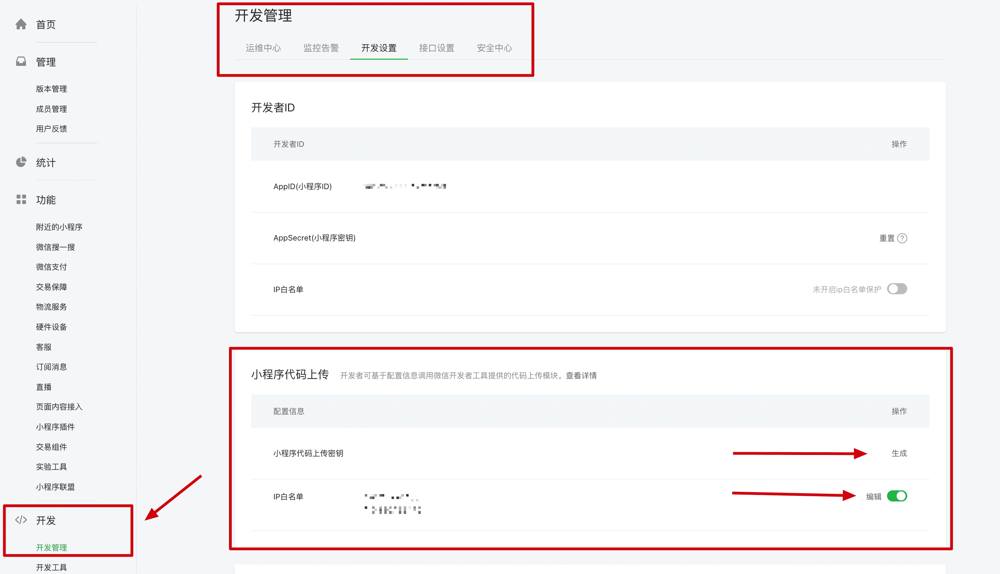
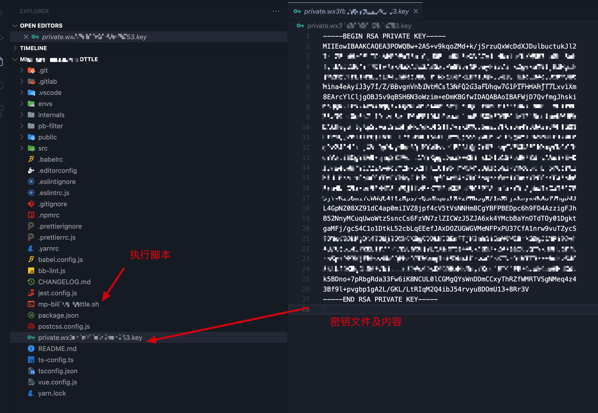
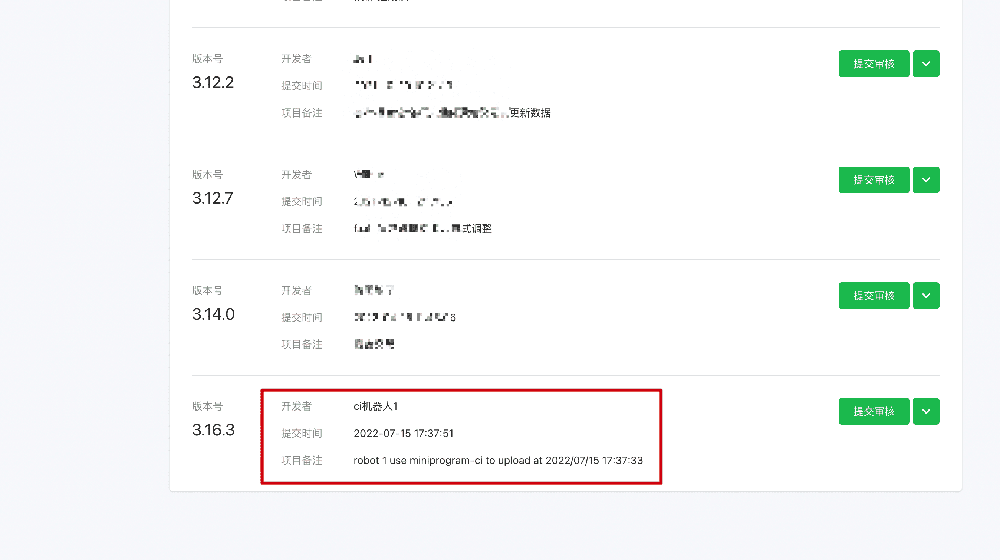

# 微信小程序自动化部署

> **summary**: 微信小程序自动化部署实现流程
>
> **tags**: 自动化部署、微信小程序、小程序、CI
>
> **author**: 大熊

---

## 前言

我们先来梳理一下日常开发微信小程序的流程：代码开发完之后我们首先要提交到代码仓库，然后使用微信开发者工具运行代码，接着通过开发者工具上传代码到微信小程序后台，最后在后台提交审核。

不难看出流程还是比较繁琐的，自动化部署流程可以帮助我们缩减这个流程，做到解放解放码农的双手，具体如何实现，我们往下看。

## miniprogram-ci

微信小程序的自动化部署流程必须依赖 miniprogram-ci，这个插件。

miniprogram-ci 是从微信开发者工具中抽离的关于小程序/小游戏项目代码的编译模块。

开发者可不打开小程序开发者工具，独立使用 miniprogram-ci 进行小程序代码的上传、预览等操作。

因为脚本的执行依赖这个插件，所以我们可以将这个插件安装在要执行脚本的服务器上，或者安装在本地项目中。

```bash
npm install miniprogram-ci --save
```


## 微信公众平台配置

登录公众平台，打开 开发-开发管理-开发设置，找到 小程序代码上传 配置项，生成小程序代码上传密钥，并添加 ip 白名单，密钥文件可以存放在要执行脚本的服务器上，或者保存在项目中，只要能让脚本访问到即可。




## 密钥文件

微信公众平台生成的密钥文件具体内容如下：



## 脚本

编写 xxx.sh 的执行脚本，命名随意。

```bash
set -e

while read -r line
do
  if [[ $line =~ "version" ]]
  then
    declare a=${line##*:}
    declare b=${a#*\"}
    declare version=${b%\"*}
    break
  fi
done < package.json

echo $version

yarn

echo "开始编译..."

start1=$(date +%s)
yarn build:mp-weixin
end1=$(date +%s)
take1=$(( end1 - start1 ))
echo "Compile Success：${take1}s"

echo "微信小程序上传..."
start2=$(date +%s)

# upload
miniprogram-ci \
  upload \
  --pp ./dist/build/mp-weixin \
  --pkp ./private.wx3fxxxxxxxx3.key \
  --appid wx3fxxxxxxxx3 \
  --uv $version \
  --threads 1 \
  -r 1 \
  --enable-es6 true \
  --enable-es7 true \
  --enable-autoprefixwxss true \
  --enable-minify true \

end2=$(date +%s)
take2=$(( end2 - start2 ))

echo "Upload Success: ${take2}s"

take3=$(( end2 - start1 ))
echo "Total Time: ${take3}s"

```

### 脚本具体模块讲解

```bash
set -e
```
表示后续所有的 bash 命令的返回 code 如果不是 0，那么脚本立即退出，后续的脚本将不会得到执行的机会。说人话就是脚本执行过程中，有报错立即退出停止执行。

```bash
while read -r line
do
  if [[ $line =~ "version" ]]
  then
    declare a=${line##*:}
    declare b=${a#*\"}
    declare version=${b%\"*}
    break
  fi
done < package.json

echo $version
```
以上脚本是逐行读取 `package.json` 文件内容，找到 `version` 字段，并获取其对应的值定义一个 `$version` 变量。直白点讲就是获取项目的版本号，因为下面要用。

```bash
yarn

echo "开始编译..."

start1=$(date +%s)
yarn build:mp-weixin
end1=$(date +%s)
take1=$(( end1 - start1 ))
echo "Compile Success：${take1}s"

echo "微信小程序上传..."
start2=$(date +%s)
```

看到 `yarn`， 大家应该都知道这段脚本就是安装项目依赖，并且打包编译小程序项目，其中的 `start1、end1、take1` 这些是记录时间的，可忽略。

```bash
# upload
miniprogram-ci \
  upload \
  --pp ./dist/build/mp-weixin \
  --pkp ./private.wx3fxxxxxxxx3.key \
  --appid wx3fxxxxxxxx3 \
  --uv $version \
  --threads 1 \
  -r 1 \
  --enable-es6 true \
  --enable-es7 true \
  --enable-autoprefixwxss true \
  --enable-minify true \

```
以上这段脚本就是核心了。

通过脚本也不难看出，我们是通过 `miniprogram-ci` 进行代码上传的。

具体参数含义：

- --pp：编译打包产物文件路径
- --pkp：微信公众平台生产的那个私钥文件路径
- --appid：小程序的 appid
- --uv：项目的版本号
- --threads：开启线程数
- -r：机器人编号（这个参数无所谓）

至此，整个脚本就基本完成了。

## 自动化部署实现

主要三个核心部分：

1. 上传脚本
2. miniprogram-ci 插件
3. 密钥文件

自动化部署实现方式有很多种，本文主要讲解两种。

### 第一种方式(推荐)

jenkins + gitlab + webhook

将脚本、密钥文件直接放在项目根目录，jenkins 安装 webhook 相关插件，gitlab 配置 webhook，这样就可以做到 master 分支代码变动就可以触发 webhook，进而触发 jenkins 执行，别忘了在 jenkins 服务器全局安装 miniprogram-ci 插件。

这样我们就实现了，当业务需求开发完，代码合并到 master 分支之后，自动触发 webhook，进而触发 jenkins 执行上传脚本。

我们开发人员需要做的就只是合并代码到 master 分支，然后到小程序后台选择上传的版本提交审核即可。

nice～

### 第二种方式

基于本地终端执行，将脚本、密钥文件直接放在项目根目录，本地安装 miniprogram-ci 插件，直接在终端中执行脚本即可。

```bash
./ci-xxx.sh
```

下图就是自动化部署上传的版本：



## 总结

以上就是小程序自动化部署的具体实现过程，希望能为迷茫的小伙伴带来一点帮助。自动化部署还有一些功能也可以实现，本文篇幅有限，没有做全部介绍，感兴趣的小伙伴可以自行探索。
