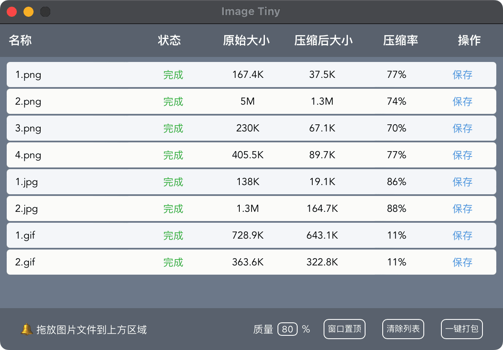
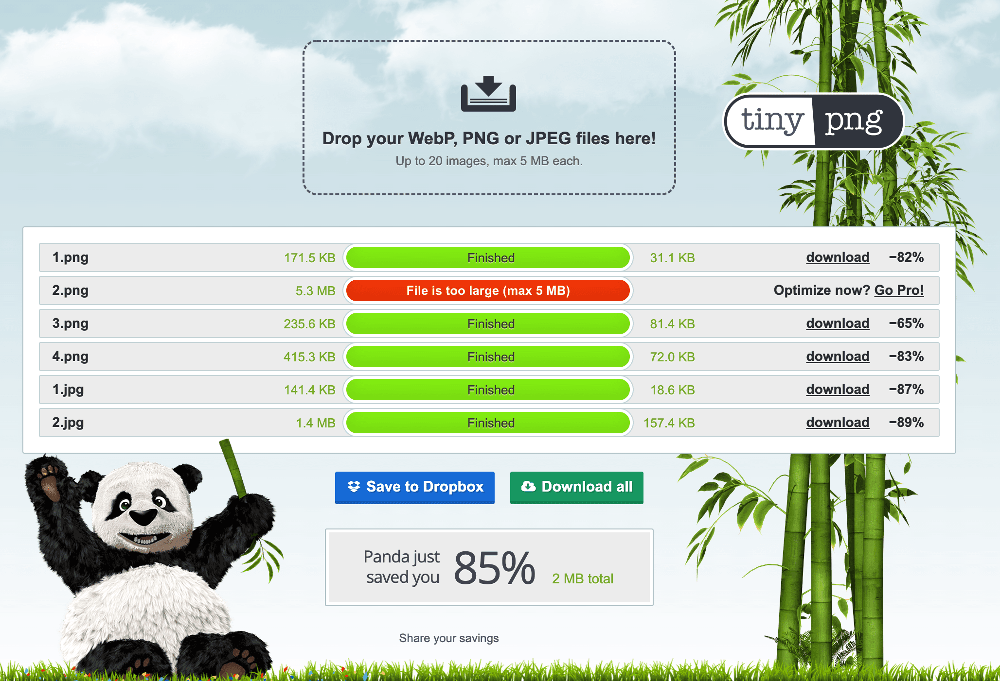
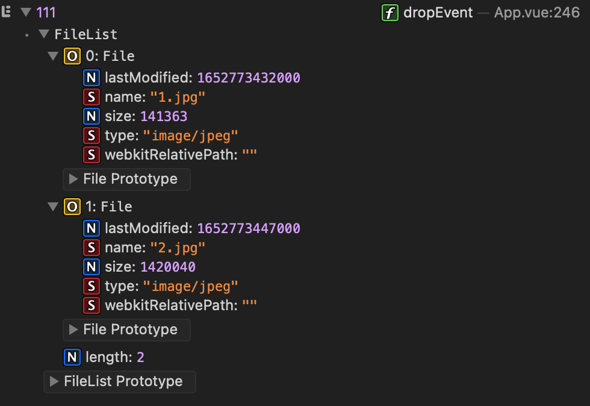
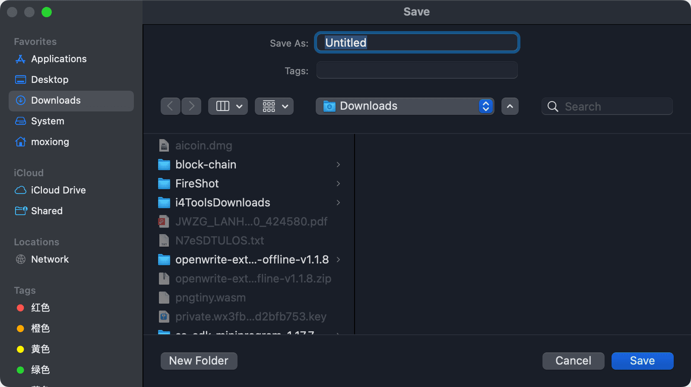
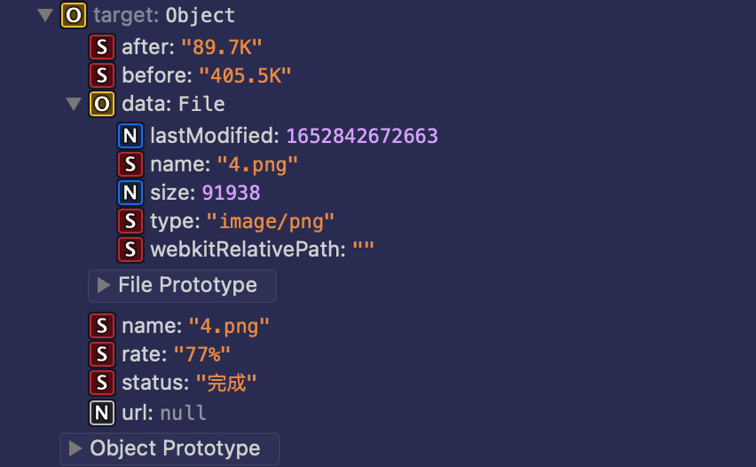
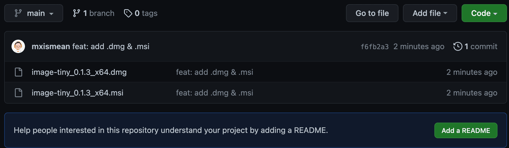

# 扔掉 Electron 后，我用 Tauri + Rust + Wasm 开发了一个图片压缩应用

> **summary**: 使用 Tauri + Rust + Wasm 开发一个本地图片压缩应用，支持 png、jpg、gif 格式，从此告别图片文件过大的烦恼
>
> **tags**: tauri、rust、wasm、webassembly、图片压缩
>
> **author**: 大熊

---

## 前言

作为前端开发人员，你是否受够了每次 UI 给到的切图都大到让你想提桶跑路的烦恼，在你打算提桶之前，请先留步，看完这篇文章再跑不迟~

## 先露个脸



我管它叫 **Image Tiny**。

大致看一下压缩率，png 和 jpg 格式基本都能达到 80% 左右，gif 能达到 11% 左右。

心动么💓，是不是还不错。

## 功能介绍

- 支持的图片格式包括 png、jpg、gif
- 支持 5M 以上图片压缩
- 不依赖网络，不依赖服务器，基于客户端本地压缩
- 支持拖拽图片文件进行压缩
- 支持压缩质量参数调整
- 支持窗口置顶
- 支持单张图片保存
- 支持一键打包，把列表中所有图片打一个zip包保存到本地

## 压缩率对比 TinyPNG

[TinyPNG](https://tinypng.com/) 这个在线图片压缩网站想必作为前端开发人员一定很熟悉，它支持 png，jpg，webp 格式的图片压缩，而且压缩率也很不错，用过它的小伙伴一定不再少数。因此 **Image Tiny** 就选择和 **TinyPNG** 进行对比。

以下是 4 张 png、2 张 jpg、2 张 gif 图片的压缩数据对比：




对于 png 格式的图片，**Image Tiny** 的压缩率基本能达到 **TinyPNG** 的水平；

对于 jpg 格式的图片，经测试把 **Image Tiny** 压缩质量调整到 80% 以下，是可以超越 **TinyPNG** 的；

对于 gif 格式的图片，不好意思，**TinyPNG** 不支持；

对于 5 MB 及以上的图片，不好意思，**TinyPNG** 也不支持；

综合来看，我们的 **Image Tiny** 还是很不错的么，而且还完全免费、不依赖网络、不依赖服务器。

## 技术实现

### 压缩核心

借助 libimagequant、libpng、libjpeg、gifsicle 这几个 C 语言的库实现图片压缩，
使用 [Emscripten SDK (emsdk) ](https://emcc.zcopy.site/) 将 C 代码编译为 wasm 文件，供浏览器端调用。

具体压缩的代码此处就不展示了，本项目有开源的计划，到时候大家自然可以看到。

### 应用框架

Tauri + Rust + Vue3.0 + Vite 

如果对 Tauri 还不熟悉，可以翻看之前发表的一篇文章：

掘金链接🔗：[扔掉 Electron，拥抱基于 Rust 开发的 Tauri](https://juejin.cn/post/7067342513920540686)

微信公众号链接🔗：[扔掉 Electron，拥抱基于 Rust 开发的 Tauri](https://mp.weixin.qq.com/s/qKGJrg6155oYdPYyKQiToA)

## 代码小窥

### 1.窗口置顶功能

```javascript
import { window } from '@tauri-apps/api';

// 窗口置顶
function handleWindowTop() {
  let curWin = window.getCurrent();
  if (datas.winTop === '窗口置顶') {
    curWin.setAlwaysOnTop(true);
    datas.winTop = '取消置顶';
  } else {
    curWin.setAlwaysOnTop(false);
    datas.winTop = '窗口置顶';
  }
}
```

从 `@tauri-apps/api` 引入 `window` api， 通过 `window.getCurrent` 方法获取到当前窗口实例，实例上有一个 `setAlwaysOnTop` 方法，通过参数 `true\false` 可以控制窗口置顶或者取消置顶。

至于为什么要给应用添加窗口置顶🔝功能，这里先挖个坑，后面会填上。

### 2.应用菜单项及快捷键添加

main.rs

```rust
use tauri::{Menu, MenuItem, Submenu};

fn main() {
  let submenu_main = Submenu::new(
    "ImageTiny".to_string(),
    Menu::new()
      .add_native_item(MenuItem::Minimize)
      .add_native_item(MenuItem::Hide)
      .add_native_item(MenuItem::Separator)
      .add_native_item(MenuItem::CloseWindow)
      .add_native_item(MenuItem::Quit),
  );

  let menu = Menu::new().add_submenu(submenu_main);

  tauri::Builder::default()
    .menu(menu)
    .run(tauri::generate_context!())
    .expect("error while running tauri application");
}
```

引入 `Menu, MenuItem, Submenu`，通过 `Submenu::new()` 方法新建一个菜单项，调用 `add_native_item` 方法添加原生的 `MenuItem` 项在其中，然后新建一个 `Menu`，通过 `Menu::new().add_submenu()` 方法将 `Submenu` 添加到菜单中，最后通过 `tauri::Builder::default().menu()` 将菜单注册到应用。

### 3.拖拽图片进行压缩功能

```html
<div
  class="middle-con"
  @dragenter="dragenterEvent"
  @dragover="dragoverEvent"
  @dragleave="dragleaveEvent"
  @drop="dropEvent"
>
  ...
</div>
```

```javascript
function dragenterEvent(event) {
  event.stopPropagation();
  event.preventDefault();
}
function dragoverEvent(event) {
  event.stopPropagation();
  event.preventDefault();
}
function dragleaveEvent(event) {
  event.stopPropagation();
  event.preventDefault();
}
function dropEvent(event) {
  event.stopPropagation();
  event.preventDefault();
  const files = event.dataTransfer.files;
  displayChsFile(files);
}
```

使用的是浏览器的 `drag` 事件来监听拖拽，在 `drop` 事件中拿到文件信息。

`drop` 事件返回的参数是一个 `DragEvent` 对象，该对象上有一个 `dataTransfer` 字段，该字段下面有一个 `files` 字段 存储的就是我们需要的 `FileList`，里面就是我们拖拽的 `File Object`；
获取到 `FileList` 后，传递给 `displayChsFile` 方法进行遍历压缩图片文件。



**tips：需要禁用掉 tauri 提供的文件拖拽事件，代码如下**

tauri.conf.json
```
{
  ...
  "tauri": {
    "windows": [
      {
        ...
        "fileDropEnabled": false,
        ...
      }
    ],
  }
  ...
}
```

### 4.图片文件压缩功能

为了方便公司其他项目接入图片压缩功能，我们将这块核心代码封装了一个私有 npm 插件，方便各个项目的接入，下面大致看一下代码：

```javascript
import pngtiny from '../plugins/pngtiny'

/**
 * @description: 图像压缩
 * @param {File} file 原始 File 文件对象
 * @param {Number} quality 压缩质量，10-90，建议 80
 * @return {Promise<File>} 压缩过的 File 文件对象
 */
const imageTiny = (file, quality = 80) => {
  pngtiny.run()
  return new Promise((resolve, reject) => {
    try {
      const reader = new FileReader()
      reader.readAsArrayBuffer(file)
      reader.onload = function(e) {
        const fcont = new Uint8Array(e.target.result)
        const fsize = fcont.byteLength
        const dataptr = pngtiny._malloc(fsize)
        const retdata = pngtiny._malloc(4)
        pngtiny.HEAPU8.set(fcont, dataptr)
        pngtiny._tiny(dataptr, fsize, retdata, quality)
        let rdata = new Int32Array(pngtiny.HEAPU8.buffer, retdata, 1)
        const size = rdata[0]
        rdata = new Uint8Array(pngtiny.HEAPU8.buffer, dataptr, size)
        const blob = new Blob([rdata], { type: file.type })
        let outFile = new File([blob], file.name, { type: file.type })
        if (outFile.size === 0) {
          outFile = file
        }
        resolve(outFile)
        pngtiny._free(dataptr)
        pngtiny._free(retdata)
      }
    } catch (error) {
      reject(error)
    }
  })
}
export default imageTiny
```

通过 `emsdk` 将 C 代码编译为 `WebAssembly` 时，会生成一个 `.wasm` 文件和一个 `.js` 的胶水代码，这个 js 胶水代码会处理 wasm 文件，我们只需要使用导出的 `pngtiny` 对象即可，上面包含了我们需要使用的方法。

imageTiny 方法输入参数为：

- file：File 文件对象
- quality：压缩质量
  
输出为：

- 压缩过的 File 文件对象

### 5.保存单个图片功能

```javascript
import { writeBinaryFile } from '@tauri-apps/api/fs';
import { path, dialog } from '@tauri-apps/api';
// 保存单个图片
async function handleSaveFile(file) {
  datas.tip = '图片保存中...';
  const basePath = await path.downloadDir();
  let selPath = await dialog.save({
    defaultPath: basePath,
  });
  selPath = selPath.replace(/Untitled$/, '');
  const reader = new FileReader();
  reader.readAsArrayBuffer(file.data);
  reader.onload = function (e) {
    let fileU8A = new Uint8Array(e.target.result);
    writeBinaryFile({ contents: fileU8A, path: `${selPath}${file.data.name}` });
    datas.tip = '图片保存成功';
  };
}
```

引入 tauri 的 api：`writeBinaryFile、path、dialog`，

使用 `dialog.save()` 方法打开一个文件保存弹框，供用户选择保存路径，
该方法有一个 `defaultPath` 参数来设置默认的保存路径，方法返回值就是最终要保存的文件路径。我们选择系统的默认下载路径作为默认保存路径，可以通过 `path.downloadDir()` 方法来获取系统默认的下载路径。



需要特别注意，由于文件保存对话框中默认提供的文件名是 `Untitled`，如果开发者没有修改或删除，那么 `dialog.save()` 方法返回的路径中就会包含一级 `Untitled` 目录，我们可以手动截取掉。

`handleSaveFile` 方法接受到的参数是一个 `File Object`，里面包含了当前图片文件的基本信息以及我们自定义的一些信息，如下图：



通过 `FileReader` api 读取到图片文件的 `Uint8Array` 数据，

通过 tauri 提供的 `writeBinaryFile` api，将文件写入本地。`writeBinaryFile` 接受一个对象参数，包含 `contents` 和 `path` 字段，
`contents` 就是文件的 `Uint8Array` 数据，`path` 就是要保存的路径。

为了使用者的方便，我们将文件名拼接到了路径上，这样用户就不需要在保存文件对话框中手动填写文件名了，直接保存即可。

### 6.一键保存功能

```javascript
import JSZip from 'jszip';

// 一键打包保存
async function handleDownloadAll() {
  const len = datas.imgList.length;
  if (len === 0) {
    return;
  }
  datas.tip = 'zip 保存中...';
  const zip = new JSZip();
  for (let i = 0; i < len; i++) {
    zip.file(datas.imgList[i].name, datas.imgList[i].data);
  }
  const date = new Date();
  const mon = (date.getMonth() + 1 < 10 ? '0' + (date.getMonth() + 1) : date.getMonth() + 1) + '_';
  const day = date.getDate() + '_';
  const hour = date.getHours() + '_';
  const min = date.getMinutes();

  const basePath = await path.downloadDir();
  let selPath = await dialog.save({
    defaultPath: basePath,
  });
  selPath = selPath.replace(/Untitled$/, '');

  zip.generateAsync({ type: 'blob' }).then((content) => {
    let file = new FileReader();
    file.readAsArrayBuffer(content);
    file.onload = function (e) {
      let fileU8A = new Uint8Array(e.target.result);
      writeBinaryFile({ contents: fileU8A, path: `${selPath}IMG_${mon + day + hour + min}.zip` });
      datas.tip = 'zip 保存成功';
    };
  });
}
```

我们借助 `jszip` 插件，来将文件打为 zip 包。

首先我们使用 `new JSZip()` 来新建一下 `zip` 实例，遍历压缩过的文件列表，调用 `zip.file()` 方法将文件添加进去，`file()` 方法接收两个参数，一个是文件名，一个是文件的内容数据。

接着通过 `dialog.save()` api 调用文件保存弹框，拿到需要保存到的路径，调用 `zip.generateAsync` 方法生成 zip 包的 `ArrayBuffer` 数据，通过 `writeBinaryFile` api，将文件写入本地。

**tips：zip包的命名方式选择了获取年月日信息来命名。**

## 踩过的坑

### 1.tauri 版本的选择

这可以说是最大的一个坑，何出此言，我们接着往下看。

起初在项目搭建初期，我满心期待的选择了最新版本的 tauri，可是当功能开发到文件系统相关的 api 时，遇到了一个严重的问题：`Unhandled Promise Rejection: cannot traverse directory`。tauri 的 fs 相关的 api 不能读取任意路径下的文件。什么？这还怎么愉快的玩耍？明明之前有用过还是可以的，难道是因为版本问题？我带着疑问和 tauri 社区进行了沟通。最终得到的答案是：处于安全考虑，在新版本中 fs 相关的 api 做了安全限制，只能访问 tauri 提供出来的几个系统路径下的文件。

这肯定行不通，我们不可能让用户压缩个图片还得事先把图片放到指定目录下才能访问吧。

于是便向 tauri 社区反馈了这个问题，他们表示后续版本会计划将用户选择的路径添加到白名单里，来绕过这个限制。

得到了答案后，解决方案就是回退 tauri 版本，于是只能退回到了旧版，具体版本信息如下：

package.json

```json
"@tauri-apps/api": "=1.0.0-beta.8",
"@tauri-apps/cli": "=1.0.0-beta.10",
```

Cargo.toml

```rust
[build-dependencies]
tauri-build = {version = "=1.0.0-beta.4"}

[dependencies]
serde = {version = "1.0", features = ["derive"] }
serde_json = "1.0"
tauri = {version = "=1.0.0-beta.8", features = ["api-all"] }
```

如果有其他小伙伴在使用 tauri 时也遇到了文件访问限制问题，可以参照回退到以上版本。

### 2.文件上传方式的选择
总的来说有三种方式，我们一一来看。

**一、input 上传方式，被 tauri 给禁止掉了，根本打不开文件选择对话框**

**二、tauri 提供的全局拖拽事件**

```javascript
import { listen } from '@tauri-apps/api/event';
listen('tauri://file-drop', async (event) => {
	console.log(event);
});
```

通过监听 tauri 提供的 `tauri://file-drop` 事件，可以拿到事件的 `event` 对象，里面会返回文件路径。没错，仅仅返回了文件路径列表，我们还需要遍历文件路径列表使用 fs 相关 api 再来读取每个路径对应的文件。此流程长且耗时，体验及其不佳。

**三、drap & drop 事件**

通过监听 `drop` 事件，可直接获取到上传的 `FileList` 对象，里面包含有文件的具体信息，可谓方便快捷，所以这个方案也是本文采取的方案。

**填个坑：**

为什么添加窗口置顶功能？

因为 **Image Tiny** 的图片上传方式是拖拽上传，如果没有窗口置顶功能的话，很容易被其他应用遮挡，势必极大降低使用体验。有了置顶功能，使用者就无需担心遮挡的问题了。

## 安装包贡献



超链：[GitHub](https://github.com/mxismean/image-tiny-package.git) 

🔗：https://github.com/mxismean/image-tiny-package.git

.dmg 格式文件为 Mac 安装包

.msi 格式文件为 Windows 安装包

欢迎大家下载安装使用，好用的话别忘了给文章点个赞👍🏻，如果能**转发**就更好了，以便更多的小伙伴可以看到。

## 总结

整个应用差不多耗费了我近一周时间才开发完成，期间也是踩坑无数，不断的摸爬滚打，寻找问题解决方案。但是当开发完成时，内心还是非常喜悦的，也希望后续能使用 Tauri 开发出来更多的小工具给大家带来一点便利~


